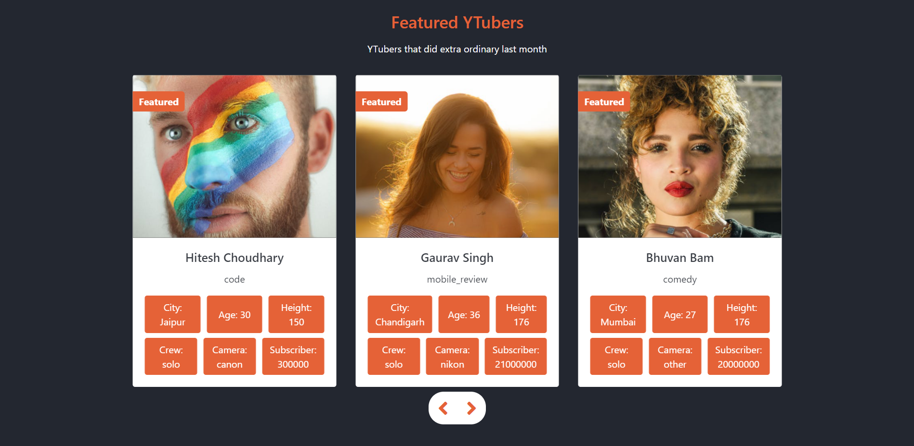
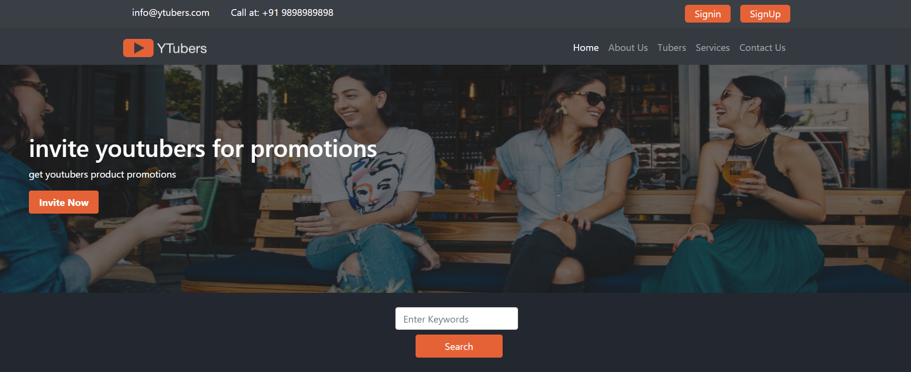
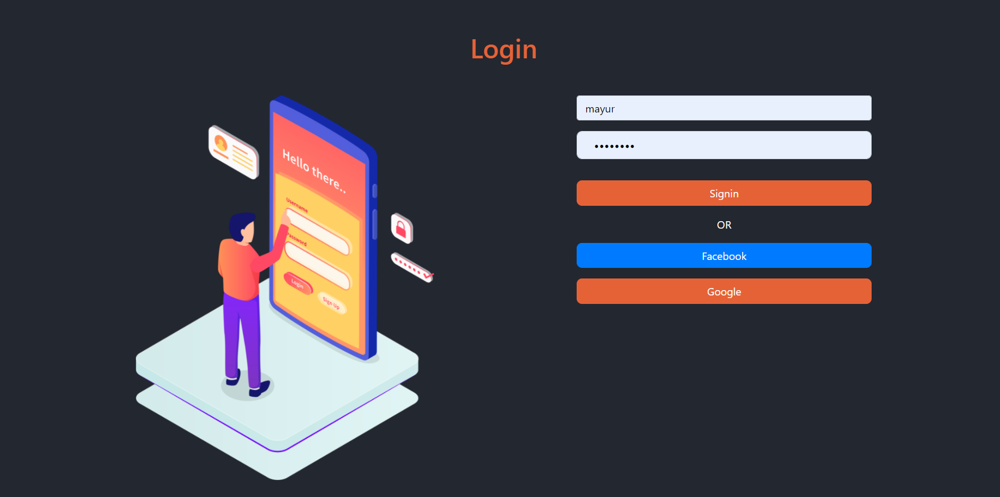
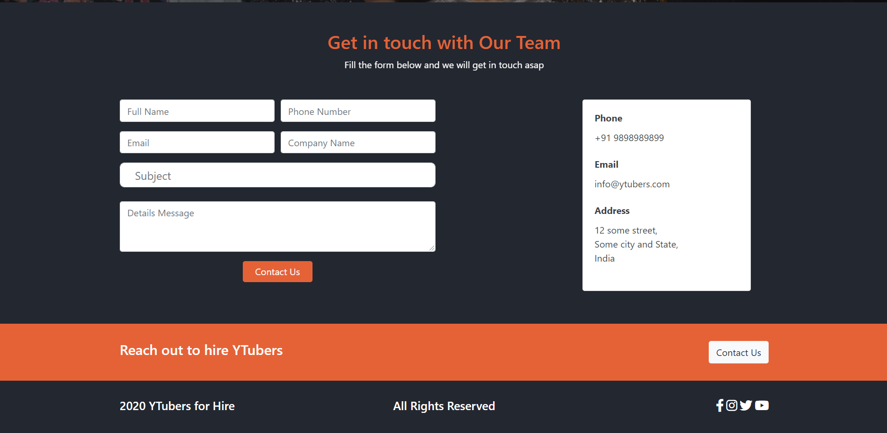
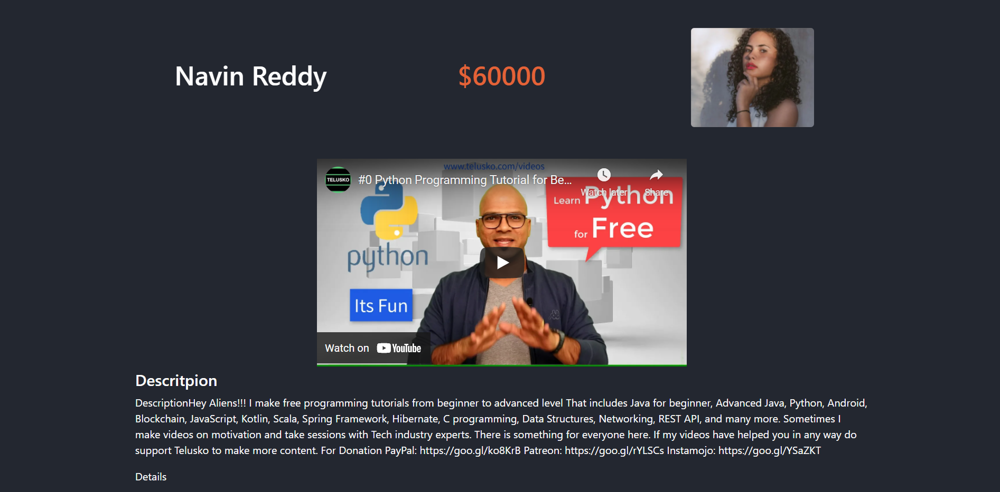

# Description 

A Fullstack project made for practice purposes (learning Django for backend).
It's a  platform where the client can contact Youtuber for various promotions.

### Functions include like : 

*  User authentication (username, Gmail, Facebook).
*  Searching through keywords and specific to YouTuber's city, role, etc.
*  Completely dynamic in nature, all the content is pulling from the database.
*  Took benefit of DTL(Django Template Language)

### Home
 

  

### Login and Contact Page 

 

### Tuber Section   

    

